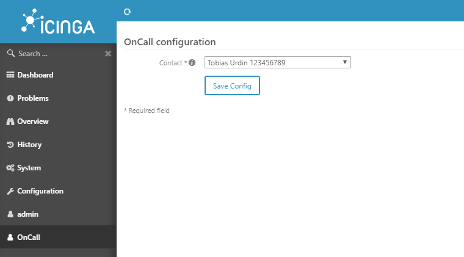

# Icinga OnCall

Icinga OnCall provides a config page for logged in users with the access to the config/modules permission to select a User for oncall.

The pager of the selected User is then saved into the /etc/icingaweb2/modules/oncall/config.ini file and can be read by your notification scripts.

It also provides an incoming URL like https://icinga/oncall/incoming that can be called with a HTTP GET to acknowledge all unhandled host and service issues.



# Installation

* Copy code to /usr/share/icingaweb2/modules/oncall directory.
* Create /etc/icingaweb2/modules/oncall directory make sure it's owned by the user running icingaweb2.
* Go to the web interface and enable the module in Configuration -> Modules.

# Example config

In Icinga2 the following has been configured.

```
object User "tobias-urdin" {
  import "generic-user"

  display_name = "Tobias Urdin"

  email = "email@domain.tld"
  pager = "123456789"
}
```

This is an example on how config.ini looks when saved and the above user was selected.

```
[oncall]
contact = "123456789"
```
